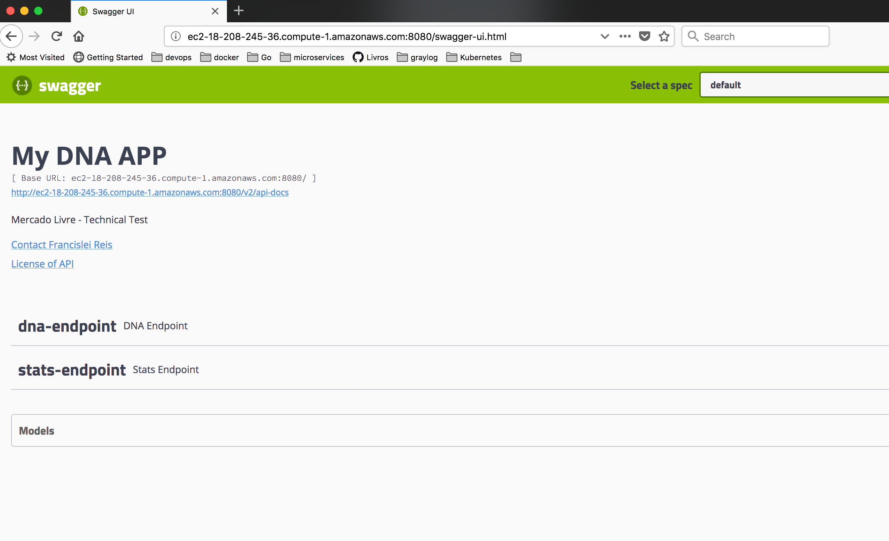

## My DNA App - Mercado Livre - Technical Test

### Challenge

There are 2 solutions, see [DNAFinder](src/main/java/br/com/app/endpoint/DNAFinder.java) the methods:

    - isMutant
    - findMutantDNANeigborhood

### Endpoints
There are 3 endpoints, see the [Swagger documentation session](#swagger-documentation):

    /mutant/ - first solution
    /mutant-second/ - second solution
    /stats/ - displays statistics

### Execution instructions

1 - Package the application

    mvn clean package

2 - Start the application

    java -jar target/dna-app-1.0.jar

### Swagger documentation

After start the application, access the link [http://localhost:8080/swagger-ui.html](http://localhost:8080/swagger-ui.html)

You'll see a page like below.

### AWS

URL: http://ec2-18-208-245-36.compute-1.amazonaws.com:8080/swagger-ui.html

